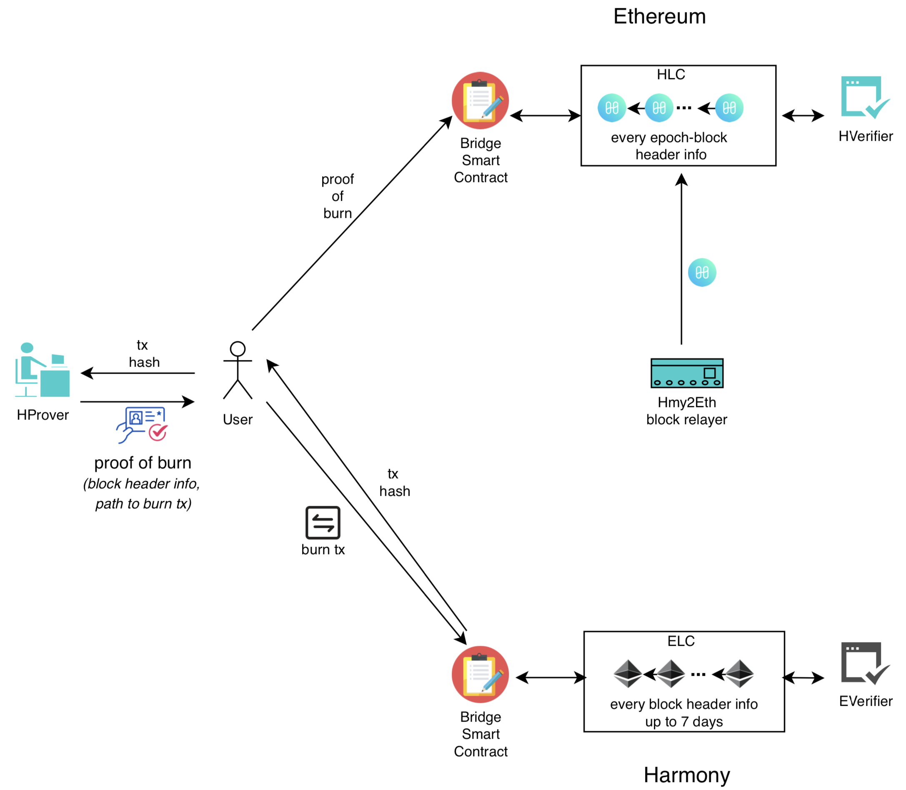

# Horizon
Horizon - a trustless harmony to ethereum bridge

## Key points

* A bridge with cross-chain light clients, relayers, and prover full nodes, all trustless, no additional trust assumptions beyond the two blockchains that the bridge is connected to.
* A gas-efficient Harmony light client on Ethereum (could be generalized to other chains) that only requires checkpoint blocks (1 block every x blocks, where 1 ≤ x ≤ 16384, 16384 is the #blocks per epoch) to verify any number of Harmony transaction proofs by the clients.
* A constant-size Harmony light client proof that any user needs to send cross-chain (e.g., Ethereum) to claim their Harmony transaction.

## Bridge Components
### Used in Ethereum to Harmony flow
* Bridge smart contract on Harmony
* Ethereum Light Client (ELC) smart contract on Harmony
* Ethereum Verifier (EVerifier) smart contract on Harmony
* Ethereum Prover (EProver) is an Ethereum full node or a client that has access to a full node
* Ethereum Relayer relays every Ethereum header information to ELC

### Used in Harmony to Ethereum flow
* Bridge smart contract on Ethereum
* Harmony Light Client (HLC) smart contract on Ethereum
* Harmony Verifier (HVerifier) smart contract on Ethereum
* Harmony Prover (HProver) is a Harmony full node or a client that has access to a full node
* Harmony Relayer relays every checkpoint block header information to HLC

## Ethereum to Harmony asset transfer
1. User locks ERC20 on Ethereum by transferring to bridge smart contract and obtains the hash of this transaction from blockchain
2. User sends the hash to EProver and receives proof-of-lock
3. User sends the proof-of-lock to bridge smart contract on Harmony 
4. Bridge smart contract on Harmony invokes ELC and EVerifier to verify the proof-of-lock and mints HRC20 (equivalent amount)

## Harmony to Ethereum asset redeem
1. User burns HRC20 on Harmony using Bridge smart contract and obtains the hash of this transaction from blockchain
2. User sends the hash to HProver and receives proof-of-burn
3. User sends the proof-of-burn to bridge smart contract on Ethereum 
4. Bridge smart contract on Ethereum invokes HLC and HVerifier to verify the proof-of-burn and unlocks ERC20 (equivalent amount)

## Setup and Run 
## Easiest way is to use existing setup (already deployed) client and verifier, bridge contracts  on ethereum ropsten and harmony testnet, 
1. Clone this repo (node_modules, configuration included)

2. cd horizon && ./index.js start-eth2hmy-relay  
 //starts eth to hmy relay

3. ./index.js transfer-eth-erc20-to-harmony     
 //sample script that does Ethereum to Harmony asset transfer described above  

## For development, redeployment/setup of your own contracts.
1. Clone this repo 

2. node_modules already included but if needed run 'npm install' in folders 'horizon, elc/ethClient, lib/src'

3. ./index.js --help shows detailed description of each command, run each command one by one in below order

4. ./index.js compile-all-contracts

5. ./index.js deploy-elc

6. ./index.js deploy-bridges-and-verifiers

7. ./index.js start-eth2hmy-relay

8. ./index.js transfer-eth-erc20-to-harmony

Note: after step 5 and before step 6, please paste the ethClientAddr in eth2hmy-relay/eth2hmy-relay.js(line no: 85) and lib/src/lib/HmyBridge.js (line no: 68) 

Note: ./index.js is the cli and will be eventually replaced by a cool name like 'horizon-bridge', every single component has its own README.md. for eg: elc has its own README.md and scripts to deploy and even test, however its best to use cli(./index.js) as the cli commands are simplified and they can even execute a series of shell commands.